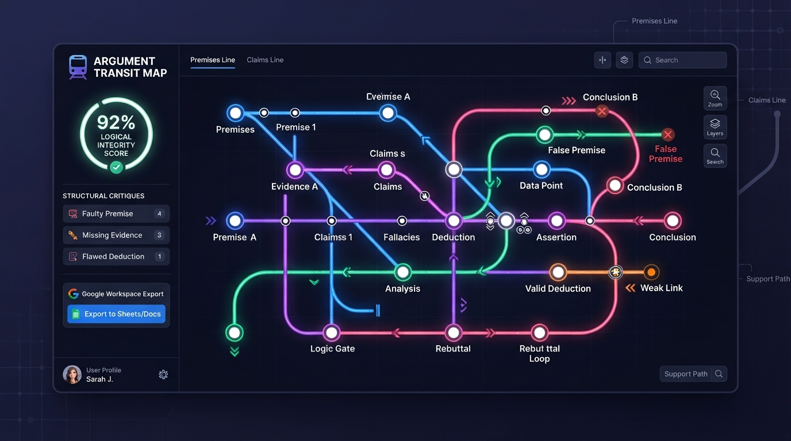

# 🚇 Argument Transit Map

> Transform complex essays, debates, and drafts into interactive subway-style topology maps, perform logical audits, conduct AI peer reviews, and export structured analyses directly to Google Docs.



---

## 🌟 Overview

**Argument Transit Map** is an open-source argumentation engine designed to illuminate the hidden structure of persuasive writing. Instead of reviewing drafts line-by-line, it maps logical premises as interconnected subway lines, station nodes, interchange junctions, logical loops, and dead-end conclusions.

Whether you are a student, researcher, lawyer, philosopher, or writer, Argument Transit Map provides actionable clarity on where your argument holds strong and where it derails.

---

## ✨ Core Features

* 🗺️ **Interactive Transit Map**: Visual subway topology featuring station nodes, interchange junctions, circular logic loops, and dead ends.
* 🛡️ **Logical Integrity Audit**: In-depth fallacy detection with 0–100 overall integrity scoring, severity indicators, and actionable repair recommendations.
* 👥 **Model Council Peer Review**: Multi-perspective critiques from specialized AI personas evaluating counter-arguments, evidence quality, and rhetoric.
* ⏳ **Past-Self Dialectical Debate**: Engage in turn-based AI debates against former versions of your own writing persona to pressure-test claims.
* 📄 **Google Workspace Export**: 1-click export converting full transit maps, critiques, and audit logs into beautifully formatted Google Docs in your Google Drive.
* 💾 **Session Management & Comparison**: Save local sessions, compare past revisions side-by-side, and track draft improvements over time.

---

## 🚀 Quick Start Guide

### Option 1: Live Web App (No Installation Needed)
For the fastest, non-technical experience, access the live hosted application directly in your browser without installing anything locally:
* **Live Web App**: [https://ais-dev-ljcpimrevbqdlccdozbrnr-127269587999.europe-west2.run.app](https://ais-dev-ljcpimrevbqdlccdozbrnr-127269587999.europe-west2.run.app)

---

### Option 2: Running Locally on Your Machine

Follow these simple steps to run the application on your own computer:

#### Prerequisites
1. **Node.js** (v18.0 or higher) — [Download Node.js](https://nodejs.org)
2. **Git** — [Download Git](https://git-scm.com)
3. **A free Gemini API Key** — [Get your API Key from Google AI Studio](https://aistudio.google.com/app/apikey)

---

#### Step 1: Clone the Repository
Open your terminal (macOS/Linux) or Command Prompt/PowerShell (Windows) and run:
```bash
git clone https://github.com/YOUR_USERNAME/YOUR_REPOSITORY.git
cd YOUR_REPOSITORY
```

#### Step 2: Install Dependencies
Run the install command to download all required packages:
```bash
npm install
```

#### Step 3: Configure Environment Variables
Create a file named `.env` in the root folder of the project (or copy `.env.example`):
```bash
cp .env.example .env
```

Open `.env` in any text editor and add your Gemini API Key:
```env
GEMINI_API_KEY="AIzaSyYourGeminiApiKeyHere"
```

#### Step 4: Start the Application
Run the local development server:
```bash
npm run dev
```

Open your browser and navigate to:
```
http://localhost:3000
```

---

## 🛠️ Project Architecture

* **Frontend**: React 18, Vite, Tailwind CSS, Motion (Framer Motion), Lucide Icons
* **Backend**: Express.js server on Node.js
* **AI Engine**: `@google/genai` TypeScript SDK utilizing `gemini-2.5-flash`
* **Google Workspace Integration**: Firebase Auth with OAuth 2.0 scopes (`documents`, `drive.file`) for seamless Google Docs generation

```
├── server.ts                       # Express backend proxy for Gemini API & Vite dev server
├── src/
│   ├── App.tsx                     # Main application layout & state machine
│   ├── components/
│   │   ├── TransitMap.tsx          # SVG Transit network canvas & station rendering
│   │   ├── ExecutiveSummaryView.tsx# High-level executive summary & critique dashboard
│   │   ├── GoogleWorkspaceExportModal.tsx # Google Docs export UI & authentication
│   │   ├── ModelCouncilView.tsx    # Multi-persona peer review interface
│   │   ├── PastSelfDebateModal.tsx # Dialectical AI debate engine
│   │   └── SessionHistoryModal.tsx # Local session manager & comparison tool
│   ├── lib/
│   │   ├── googleDocsExport.ts     # HTML-to-Google Doc Drive API conversion
│   │   └── workspaceAuth.ts        # Firebase Auth & Google OAuth scope handler
│   └── types.ts                    # Global TypeScript data schemas
└── README.md
```

---

## 💡 How to Customize & Fork

This repository is built to be modular and open source. Here are popular ways to customize it for your needs:

* **Add Custom AI Personas**: Update `server.ts` under the `/api/analyze-council` endpoint to define new reviewer personas tailored to your industry (e.g., Legal Scholar, Scientific Peer Reviewer, Investigative Journalist).
* **Adjust Transit Line Algorithms**: Customize `src/components/TransitMap.tsx` to tweak subway line rendering, curve geometry, or station node physics.
* **Integrate Custom Databases**: Replace local storage persistence with Firestore or PostgreSQL for multi-user collaboration.

---

## 📄 License

Distributed under the **MIT License**. See `LICENSE` for details.

---

## ❤️ Contributing

Contributions, feedback, and pull requests are welcome! Feel free to open an issue or submit a PR to help improve Argument Transit Map.
